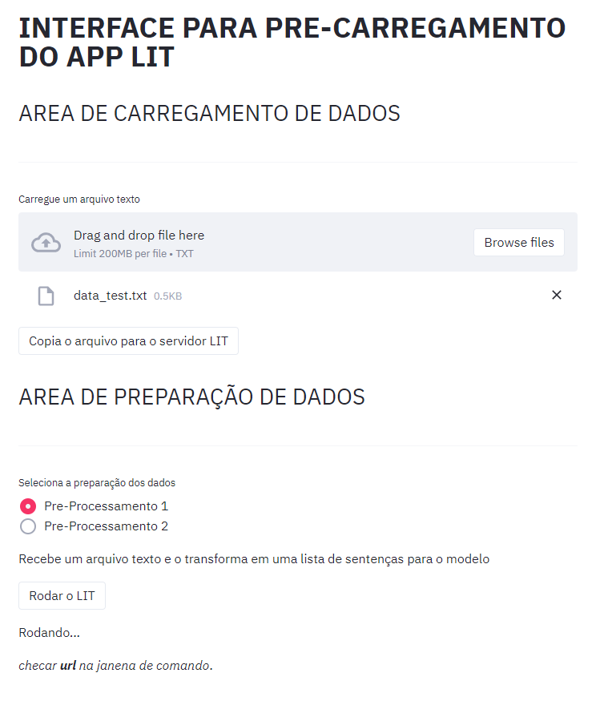
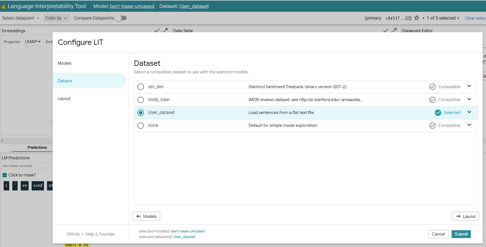

# EasyRunLIT

## INF2102 - Projeto Final de Programação

**2020.2**

Disciplina do programa de pós-graduação do Departamento de Informática da PUC-Rio.

## NOTAS INICIAIS

Este projeto é uma P.O.C de interface inicial para rodar o aplicativo LIT.
Esta versão roda apenas previsões de um modelo de linguagem pré-treinado do LIT para arquivos textos "flat" do usuário


## Instalação

### Instalando ambiente virtual

Sugestão de crianção de ambiente virtual

```bash
python -m venv lit-nlp
```
obs: ativar o ambiente virtual após a criação do mesmo, para os seguintes passos de instalação.

### Instalando o LIT

Instalando o Language Interpretability Tool (LIT)

```bash
pip install lit-nlp
```
para maiores detalhes consultar diretamente o repositório do LIT: https://github.com/PAIR-code/lit

### Instalando as dependências

```bash
pip install -r requirements.txt
pip install streamlit
````

### Project Structure

```
├── requirements                            - Especicifa as dependências de bibliotecas.
|
├── easyrunlit.py                           - Arquivo de execução do programa.
|
├── Demo_Datas                              - Arquivo texto para teste/demonstração.
|
├── Docs                                    - Relatório e manual completo do projeto.
|
├── Setenv                                  - Configuração de ambiente
│   ├── setenv.py                           - Pacote para selecão e copia de arquinos no servidor
|
├── Examples                                - Exemplos de casos.
│   ├── pretrained_lm_demo2.py              - Pacote de exemplo a ser colocado no LIT.
|
├── Tests                                   - Repositório de testes.
│   └── test_flattext.py                    - Arquivo de testes das funções do pacote flattext.
│   └── test_setenv.py                      - Arquivo de testes das funções do pacote setenv.
|
├── Userclasses                             - Repositório com as classses de preparação e carga de dados.
│   └── flattext.py                         - Pacote para preparação do arquivo de texto carregado no LIT
|
├── Img                                     - Repositório de imagens para documentações.


```

### Instalando o EasyRunLIT 

1. Copiar/baixar a estrutura deste repositório para a raiz do ambiente virtual criado: lit-nlp
2. Copiar o arquivo pretrained_lm_demo2.py para a pasta ..\lit-nlp\Lib\site-packages\lit_nlp\examples\ pretrained_lm_demo2.py

## Execução

Para executar o programa:

```bash
streamlit rum easyrunlit.py
```
Tela do Easyrunlit



Tela de seleção do Dataset no LIT , marcar opção conforme imagem para seleção de dataset prórpio/carregado.



## Relatório

Para relatório completo, inclusive manual de usuario, ler o documento do link abaixo

* [INF2102_Projeto_Final_de_Programacao_Pedro.pdf](https://github.com/pedrohesch/EasyRunLIT/blob/main/Docs/INF2102_Projeto_Final_de_Programacao_Pedro.pdf)


